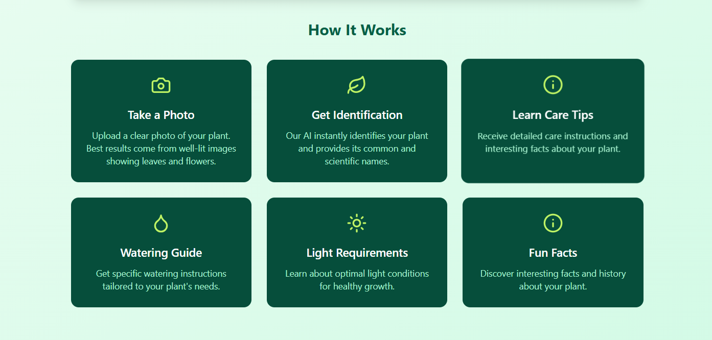
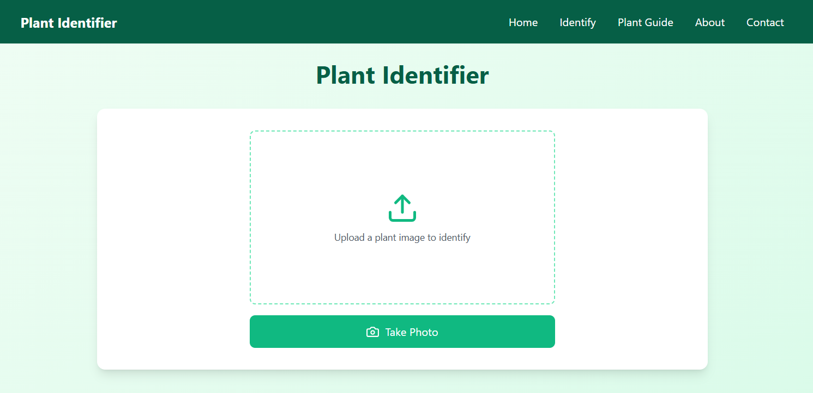
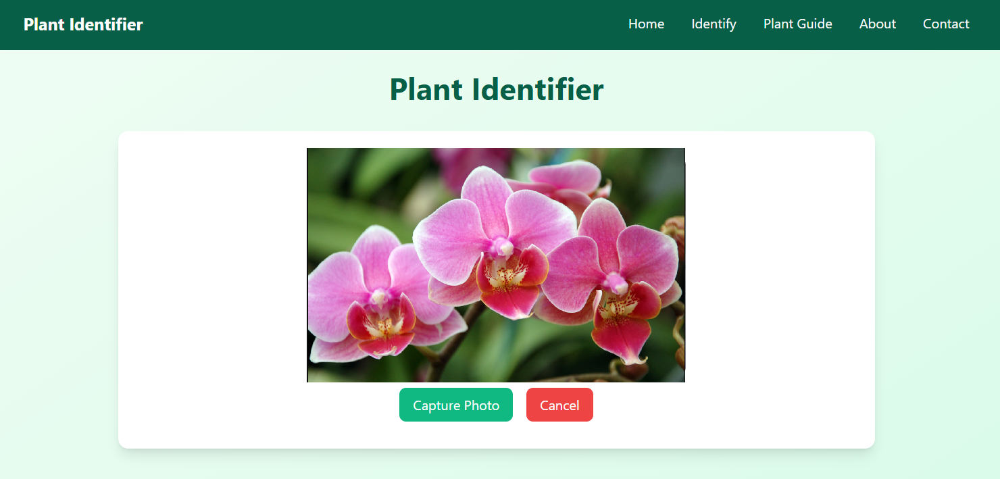
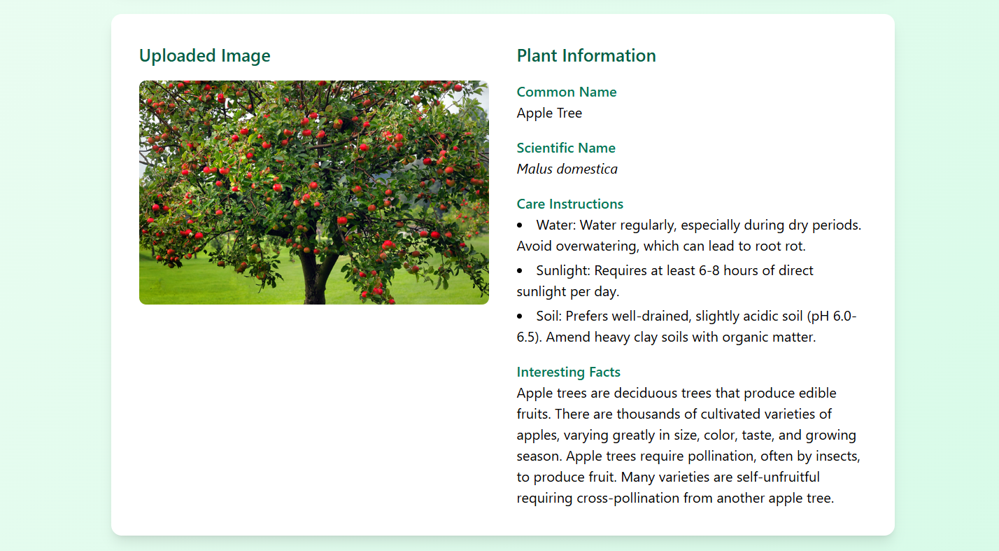

# Plant Identifier 🌿

## Overview
Plant Identifier is a web application built with Next.js and React that uses Google's Gemini AI to help users identify plants through image recognition and provide detailed care instructions.

## Features
- 📸 Image Upload: Upload a plant image from your device
- 📷 Camera Capture: Take a photo directly in the browser
- 🤖 AI-Powered Identification: Instantly identify plant species
- 🌱 Comprehensive Plant Information:
  - Common and scientific names
  - Care instructions (water, sunlight, soil)
  - Interesting plant facts

## Screenshots
### How It Works


### Image Upload


### Camera Capture


### Plant Identification Result


## Prerequisites
- Node.js (v18+)
- npm or yarn
- Google Gemini API Key

## Installation
1. Clone the repository
   ```bash
   git clone https://github.com/yourusername/plant-identifier.git
   cd plant-identifier
   ```

2. Install dependencies
   ```bash
   npm install
   ```

3. Create a `.env.local` file and add your Gemini API key
   ```
   NEXT_PUBLIC_GEMINI_API_KEY=your_api_key_here
   ```

4. Run the development server
   ```bash
   npm run dev
   ```

## Technologies Used
- Next.js 14
- React
- Google Gemini AI
- Tailwind CSS
- TypeScript

## Environment Variables
- `NEXT_PUBLIC_GEMINI_API_KEY`: Required for plant identification

## Contributing
1. Fork the repository
2. Create your feature branch (`git checkout -b feature/AmazingFeature`)
3. Commit your changes (`git commit -m 'Add some AmazingFeature'`)
4. Push to the branch (`git push origin feature/AmazingFeature`)
5. Open a Pull Request

## License
Distributed under the MIT License. See `LICENSE` for more information.
